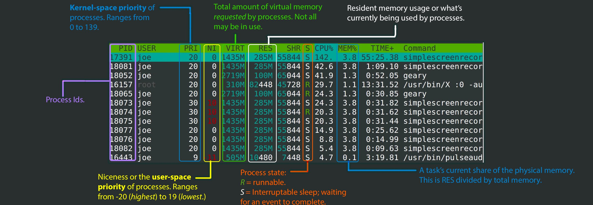

# Linux relevant commands

```
# Description of the filesystem hierarchy
man 7 hier
```

# Tools 

# Utilities

```
# See installed package Date and Time on Debian or Ubuntu
zgrep " installed " /var/log/dpkg.log*
```

```
# Get distro RHEL/Fedora/CentOS version number
rpm -E %rhel
rpm -E %fedora
rpm -E %centos
```

```
# Display information about installed hardware on Linux
lsdev
hwinfo --short
lshw -short
```
```
# Compress and transfer a .tar.gz file securely over SSH when ther is no disk space on client
tar xzcf - whatever/ | ssh user@host 'cat > whatever.tar.gz'
```

```
crontab -e #Edit configuration file
#Minutes Hour Month_day Month Weekday Command
# 0-59   0-23    1-31   1-12    0-7   bash.sh

contrab -l #List rules

#Important directories 
#/etc/cron.<TAB> 
#vim /etc/crontab
#vim /etc/cron.allow #Insert username to allow who can do cronconfigs
#vim /etc/cron.deny  #Insert username to deny who can do cronconfigs
```

```
#Show common linux defined ports
less /etc/services
```

```
#Show archives ordered by older
ls -ltr
```

```
#List only files/directories
ls -1
```

```
#Show actual shell
echo $0
```

# Troubleshoot

```
# Show kernel informations on boot
dmesg
```

```
# Inode disk space human readeble
df -ih
```

```
# Show open network connections by programs 
netstat -atunp
```

```
# Show processes
ps -ef
```

```
# Show processes real-time
top
```

```
# A better top
htop
```


```
# Show installed packages via RPM
rpm -qa
```

```
#System commands/processes troubleshoot tool
strace -o output -f command

strace -fp #trace by PID 

strace -c #List syscalls
```

# Network

```
# Show network connections IPs by adapter in color
ip -br -c a
```

```
# Check your public IP
curl -s https://checkip.amazonws.com
```

```
# Check your privates IPs
hostname -I
```

# Hacks

```
# Save file on VIM without permission
:w !sudo tee %
```

# Windows relevant commands

## Network troubleshoot

```
# Check the routing table
netstat -r
``` 

```
# Test connection with a Database
tnsping <BD Name>
```

```
# Test connection 
# i.e telnet 10.0.0.10 3389 to check if RDP e enabled on remote host 
telnet <host-ip> <port>
```

